# TORASAN 全体アーキテクチャ仕様書

**文書番号**: TSDT-ARCH-001
**版数**: v1.1
**初版作成日**: 2026-03-06
**最終更新日**: 2026-03-07
**ステータス**: 承認済

## 改版履歴

| 版数 | 日付 | 変更内容 | 承認 |
|------|------|---------|------|
| v1.0 | 2026-03-06 | 初版作成 | TORA |
| v1.1 | 2026-03-07 | スキル/ナレッジ数修正(40/19)、packages/ 廃止反映、validate 重複修正、ナレッジ一覧更新 | TORA |

---

## 1. 概要

### 1.1 プロジェクト目的

TORASAN は **ISO 26262 + Automotive SPICE** ベースの機能安全開発フレームワーク。
AI (Claude Code) が V 字モデル全 15 フェーズを自動実行する前提で設計されている。

### 1.2 対象製品

| 項目 | 値 |
|------|------|
| 製品 | 洗濯機 BLDC モータ制御 |
| MCU | Renesas RL78/G14 (R5F104BG), 64KB Flash, 5.5KB RAM, 32MHz |
| 製品安全規格 | IEC 60730 Class B |
| プロセス基盤 | ISO 26262 V-model / SPICE / FMEA / FTTI |
| モータ | BLDC 1500W / 1200rpm / 6A |

### 1.3 3層アーキテクチャ

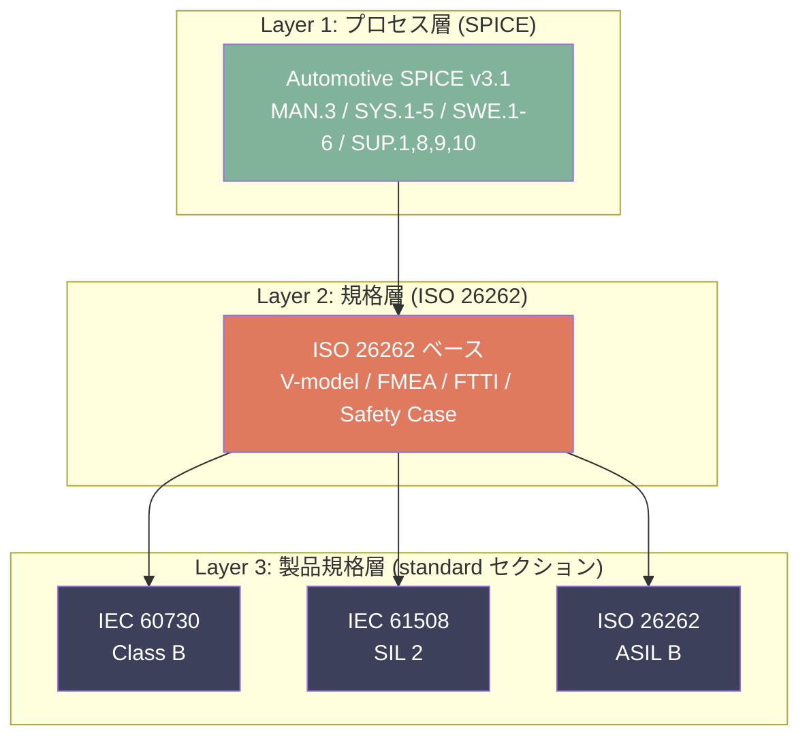

> **Note**: 製品規格は project.json の `standard` セクションで選択・管理する。
> 旧 `packages/` ディレクトリは廃止済み（v1.1 で standard セクションに統合）。

---

## 2. システム全体構成

### 2.1 コンポーネント図

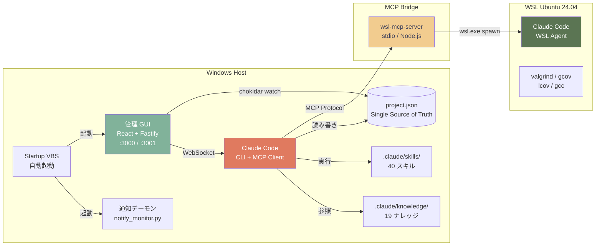

### 2.2 リポジトリ構成

```
TORASAN/
├── CLAUDE.md                  # Claude Code プロジェクト設定 (v5.0)
├── PROCESS.md                 # ISO 26262 + SPICE プロセス定義書 (v3.2)
├── INGEST.md                  # 既存資産取り込み手順書
├── project.json               # Single Source of Truth (schema 3.0)
├── .mcp.json                  # MCP Server 登録
├── install.sh                 # 汎用スキル・ナレッジ配布
│
├── app/                       # 管理 GUI (React 19 + Fastify 5)
│   ├── src/                   #   フロントエンド
│   ├── server/                #   バックエンド API
│   └── shared/                #   共有型定義
│
├── .claude/
│   ├── skills/                # 全40スキル (汎用14 + ドメイン26)
│   ├── knowledge/             # ナレッジ (汎用8 + ドメイン11 = 19本)
│   └── launch.json            # Preview Server 設定
│
├── scripts/
│   ├── wsl-mcp-server/        # WSL ↔ Windows MCP ブリッジ
│   ├── generate_*.py          # ドキュメント生成スクリプト
│   └── requirements.txt       # Python 依存
│
├── process_records/           # SPICE プロセス記録 (16本)
├── src/                       # C ソース (RL78/G14 BLDC制御)
├── docs/                      # 設計文書・マニュアル
├── tools/                     # DOCX/XLSX 生成 JS ツール
└── platforms/                 # MCU プラットフォーム設定
```

---

## 3. スキルシステム

### 3.1 スキル分類図

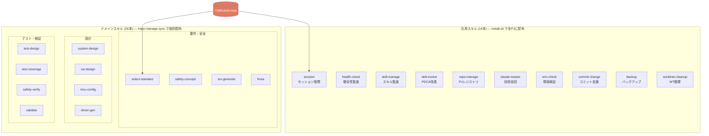

### 3.2 スキル一覧

| # | カテゴリ | スキル名 | 用途 |
|---|---------|---------|------|
| 1 | 汎用 | session | セッション開始/終了/反省会 |
| 2 | 汎用 | dashboard | プロジェクト概要表示 |
| 3 | 汎用 | health-check | プロジェクト健全性監査 |
| 4 | 汎用 | skill-manage | スキル品質監査・一覧 |
| 5 | 汎用 | skill-evolve | PDCA 改善サイクル |
| 6 | 汎用 | repo-manage | PJ レジストリ・スキル同期 |
| 7 | 汎用 | backup | Git タグバックアップ |
| 8 | 汎用 | commit-change | コミットワークフロー |
| 9 | 汎用 | config-audit | 設定ファイル監査 |
| 10 | 汎用 | worktree-cleanup | ワークツリー整理 |
| 11 | 汎用 | update-record | プロセス記録更新 |
| 12 | 汎用 | env-check | 環境チェック |
| 13 | 汎用 | platform-info | OS/シェル情報 |
| 14 | 汎用 | claude-master | 技術巡回・最新化 |
| 15 | ドメイン | execute-phase | V-model フェーズ実行 |
| 16 | ドメイン | assess-spice | SPICE 能力評価 |
| 17 | ドメイン | select-standard | 規格選択支援 |
| 18 | ドメイン | switch-standard | 規格切り替え |
| 19 | ドメイン | safety-concept | 安全コンセプト策定 |
| 20 | ドメイン | srs-generate | SRS 生成 |
| 21 | ドメイン | fmea | FMEA 実施 |
| 22 | ドメイン | system-design | システム設計 |
| 23 | ドメイン | sw-design | SW 詳細設計 |
| 24 | ドメイン | motor-control | モータ制御設計 |
| 25 | ドメイン | mcu-config | MCU 設定 |
| 26 | ドメイン | hw-review | HW レビュー |
| 27 | ドメイン | memory-map | メモリマップ管理 |
| 28 | ドメイン | driver-gen | デバイスドライバ生成 |
| 29 | ドメイン | static-analysis | 静的解析 (cppcheck/MISRA) |
| 30 | ドメイン | safety-diag | 安全診断設計 |
| 31 | ドメイン | test-design | テスト設計 |
| 32 | ドメイン | systest-design | システムテスト設計 |
| 33 | ドメイン | test-coverage | テストカバレッジ計測 |
| 34 | ドメイン | safety-verify | 安全検証 |
| 35 | ドメイン | validate | 統合検証 |
| 36 | ドメイン | manage-tbd | TBD 項目管理 |
| 37 | ドメイン | problem-resolve | 問題解決管理 (SUP.9) |
| 38 | ドメイン | trace | トレーサビリティ管理 |
| 39 | ドメイン | generate-docs | 文書生成 |
| 40 | ドメイン | ingest | 既存資産取り込み |

### 3.3 スキル配布シーケンス図

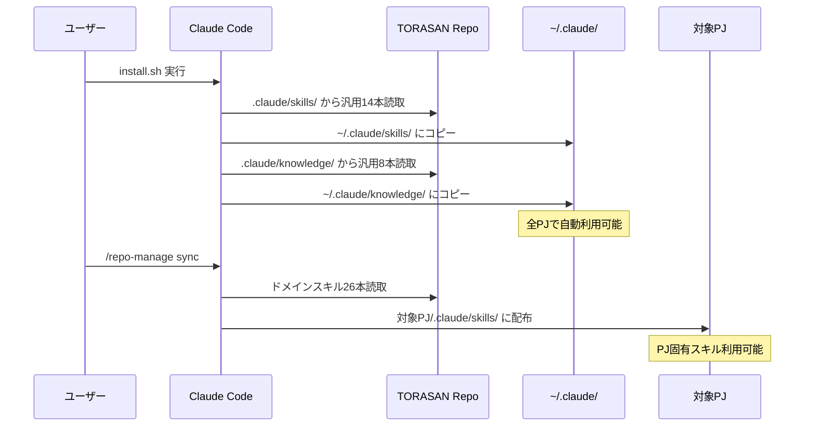

---

## 4. 管理 GUI アプリ

### 4.1 技術スタック

| レイヤー | 技術 | バージョン |
|---------|------|----------|
| フロントエンド | React + TypeScript | 19.x / 5.9.3 |
| ビルドツール | Vite | 7.x |
| CSS | Tailwind CSS | 4.x |
| 状態管理 | Redux Toolkit | 2.x |
| ルーティング | react-router-dom | 7.x (BrowserRouter) |
| 文書生成 | docx / exceljs | 9.x / 4.x |
| バックエンド | Fastify + WebSocket | 5.x |
| ファイル監視 | chokidar | 5.x |
| 開発ツール | tsx / concurrently | 4.x / 9.x |
| Lint | ESLint + typescript-eslint | 9.x / 8.x |

### 4.2 12 ページ構成

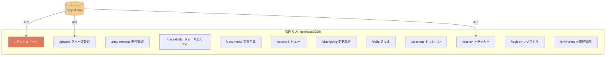

### 4.3 フロントエンド コンポーネント構成

```
src/
├── App.tsx                    # ルート (BrowserRouter + Routes)
├── main.tsx                   # エントリポイント
├── pages/                     # 12 ページコンポーネント
│   ├── DashboardPage.tsx
│   ├── PhaseNavigatorPage.tsx
│   ├── RequirementEditorPage.tsx
│   ├── TraceMatrixPage.tsx
│   ├── DocumentGeneratorPage.tsx
│   ├── ReviewPage.tsx
│   ├── ChangeLogPage.tsx
│   ├── SkillsPage.tsx
│   ├── SessionsPage.tsx
│   ├── TrackerPage.tsx
│   ├── RegistryPage.tsx
│   └── EnvironmentPage.tsx
├── components/
│   ├── layout/                # MainLayout, Header, Sidebar
│   ├── common/                # ProgressBar, StatusBadge
│   ├── dashboard/             # ProjectDashboard
│   ├── phases/                # PhaseCard, VModelDiagram
│   ├── tracker/               # IssueList, IdeaList
│   └── documents/             # DocumentGenerator
├── store/
│   ├── index.ts               # Redux Store 設定
│   ├── hooks.ts               # useAppSelector, useAppDispatch
│   └── slices/
│       ├── projectSlice.ts    # project.json 全体
│       ├── uiSlice.ts         # UI 状態
│       └── requirementsSlice.ts
└── lib/
    ├── api/
    │   ├── client.ts          # fetch ラッパー
    │   └── websocket.ts       # WebSocket クライアント
    └── generators/
        ├── docxGenerator.ts   # DOCX 生成
        ├── traceMatrix.ts     # XLSX 生成
        ├── traceData.ts       # トレースデータ定義
        ├── styling.ts         # 文書スタイル
        └── templates/         # 5 テンプレート
            ├── systemSpec.ts
            ├── processSpec.ts
            ├── ingestSpec.ts
            ├── traceEvidence.ts
            └── architectureSpec.ts
```

### 4.4 API エンドポイント一覧

| メソッド | パス | 用途 |
|---------|------|------|
| GET | `/api/project` | project.json 全体取得 |
| PATCH | `/api/project` | project.json 部分更新 |
| GET | `/api/changelog` | 変更履歴取得 |
| POST | `/api/changelog` | 変更履歴追加 |
| GET | `/api/skills` | スキル一覧取得 |
| GET | `/api/sessions` | セッション記録取得 |
| GET | `/api/registry` | プロジェクトレジストリ |
| GET | `/api/environment` | 環境チェック結果 |
| GET/PATCH | `/api/tracker` | Issues/Ideas 管理 |
| WS | `/api/ws` | WebSocket リアルタイム更新 |

### 4.5 リアルタイム更新パイプライン

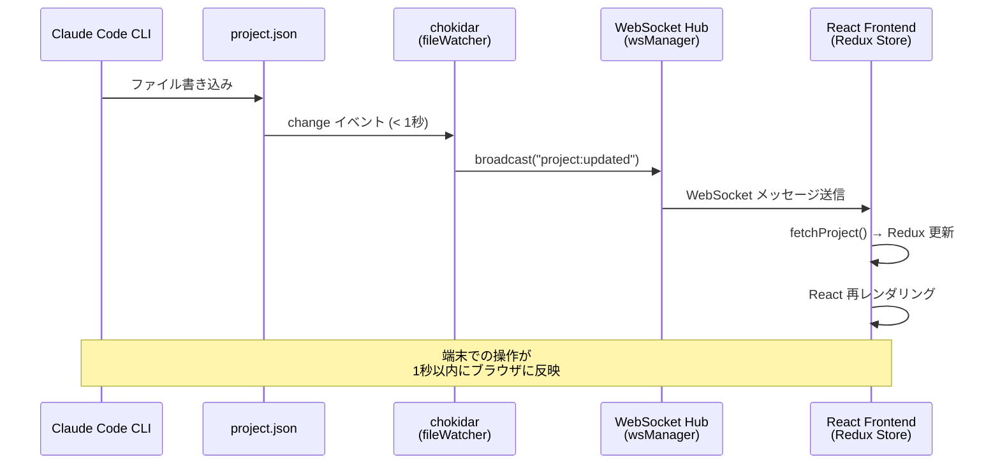

---

## 5. WSL エージェント連携

### 5.1 アーキテクチャ

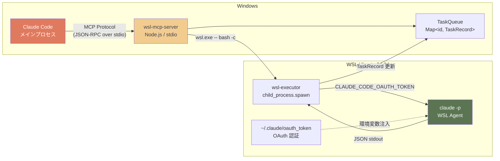

### 5.2 MCP ツール一覧

| ツール | 引数 | 動作 |
|--------|------|------|
| `delegate_task` | task, async, model, timeout, max_turns, cwd | WSL Claude Code にタスク委任 |
| `check_task_status` | task_id | タスク状態確認 (running/completed/failed) |
| `get_task_result` | task_id | 完了タスクの結果取得 |
| `list_tasks` | — | 全タスク一覧 |

### 5.3 タスク状態遷移図

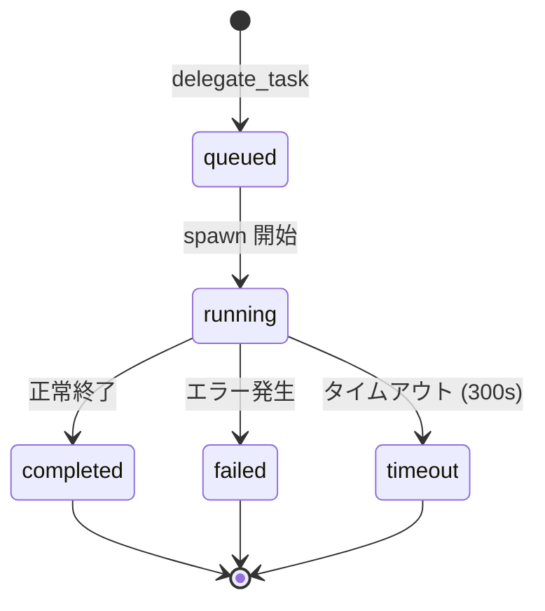

---

## 6. データモデル (project.json)

### 6.1 クラス図

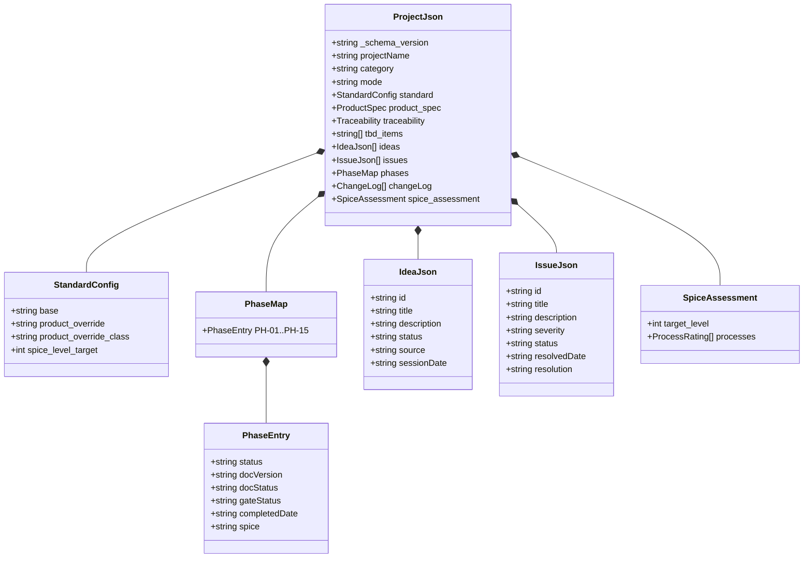

---

## 7. V 字モデル (15 フェーズ)

### 7.1 V 字配置図

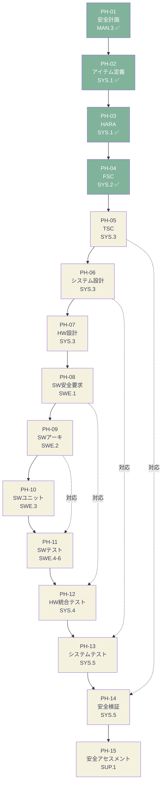

### 7.2 フェーズ一覧

| ID | 名称 | SPICE | 状態 | 文書 | ゲート |
|----|------|-------|------|------|--------|
| PH-01 | 安全計画 | MAN.3 | completed | v2.1 | PASS |
| PH-02 | アイテム定義 | SYS.1 | completed | v2.0 | PASS |
| PH-03 | HARA | SYS.1 | completed | v2.1 | PASS |
| PH-04 | FSC | SYS.2 | completed | v2.1 | PASS |
| PH-05 | TSC | SYS.3 | not_started | — | — |
| PH-06 | システム設計 | SYS.3 | not_started | — | — |
| PH-07 | HW 設計 | SYS.3 | not_started | — | — |
| PH-08 | SW 安全要求 | SWE.1 | not_started | — | — |
| PH-09 | SW アーキ設計 | SWE.2 | not_started | — | — |
| PH-10 | SW ユニット設計 | SWE.3 | not_started | — | — |
| PH-11 | SW テスト | SWE.4-6 | not_started | — | — |
| PH-12 | HW 統合テスト | SYS.4 | not_started | — | — |
| PH-13 | システムテスト | SYS.5 | not_started | — | — |
| PH-14 | 安全検証 | SYS.5 | not_started | — | — |
| PH-15 | 安全アセスメント | SUP.1 | not_started | — | — |

---

## 8. ナレッジベース

### 8.1 2 層ナレッジ構成

| スコープ | パス | 件数 | 配布方法 | 内容 |
|---------|------|------|---------|------|
| グローバル（汎用） | `~/.claude/knowledge/` | 8 | install.sh | Claude Code 運用、メモリ管理、スキルライフサイクル、エラー防止 |
| ドメイン（PJ 固有） | `.claude/knowledge/` | 11 | /repo-manage sync | 規格要件、MISRA-C、FMEA、BLDC 安全、SPICE、作図 |

### 8.2 ナレッジ一覧

**グローバル (8 本)** — install.sh で `~/.claude/knowledge/` に配布:

| # | ファイル | 内容 |
|---|---------|------|
| 1 | `claude_code_ops.md` | Claude Code 操作手順（セッション管理、メモリシステム） |
| 2 | `claude_platform_updates.md` | プラットフォーム機能追跡・変更ログ監視 |
| 3 | `skill_lifecycle.md` | スキル成熟度モデル（L1〜L5 定義） |
| 4 | `skill_feedback_log.md` | スキルフィードバック収集・改善追跡 |
| 5 | `git_worktree_branch_management.md` | Git ワークツリー操作手順 |
| 6 | `cross_platform_dev.md` | マルチプラットフォーム開発（パス変換等） |
| 7 | `memory_paths.md` | メモリ・状態ファイルパス構成 |
| 8 | `error_prevention.md` | エラー防止・PDCA プロセス定義 |

**ドメイン (11 本)** — `.claude/knowledge/` に格納:

| # | ファイル | 内容 |
|---|---------|------|
| 1 | `automotive_spice.md` | SPICE 評価リファレンス（PA 評価、能力レベル） |
| 2 | `bldc_safety.md` | BLDC モーター安全分析 |
| 3 | `fmea_guide.md` | FMEA 手法ガイド（重大度・発生度・検出度） |
| 4 | `iso26262_iec60730.md` | デュアルコンプライアンスリファレンス |
| 5 | `misra_c_2012.md` | MISRA-C:2012 コーディング規約 |
| 6 | `product_standard_mapping.md` | 規格選定ガイド（自動車/家電/産業/医療） |
| 7 | `safety_case_gsn.md` | GSN による安全ケース記述 |
| 8 | `safety_diagnostics.md` | 診断カバレッジ・SFF 計算手法 |
| 9 | `srs_template.md` | ソフトウェア要件仕様書テンプレート |
| 10 | `pptx_advanced_shapes.md` | python-pptx 高度図形操作リファレンス |
| 11 | `uml_diagramming.md` | UML 作図リファレンス（python-pptx 実装パターン） |

---

## 9. 起動自動化・通知システム

### 9.1 デプロイメント図

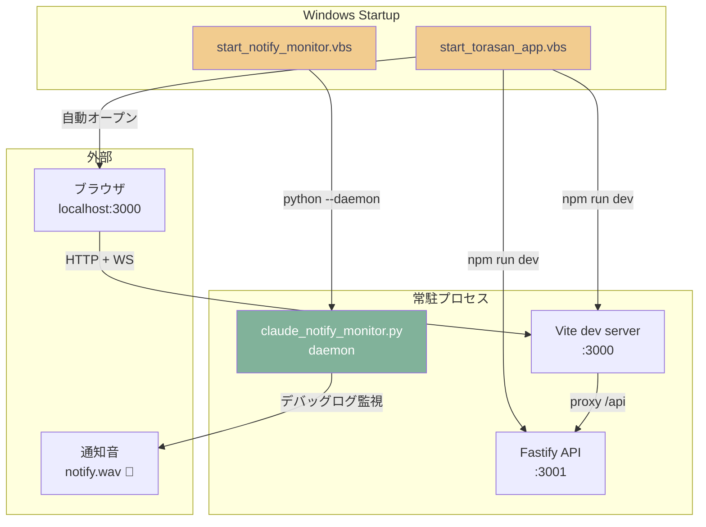

### 9.2 通知デーモンの仕組み

1. `claude_notify_monitor.py` が `~/.claude/debug/` をポーリング監視
2. Claude Code のデバッグログから「ユーザー入力待ち」パターンを検出
3. PowerShell 経由で `notify.wav` を再生
4. Claude Code 本体の Stop フックバグ (Issue #29560) の回避策

---

## 10. 技術スタック一覧 (2026-03-06 時点)

### 10.1 Windows ホスト

| ツール | バージョン |
|--------|----------|
| Node.js | 24.14.0 |
| npm | 11.9.0 |
| Python | 3.14.3 |
| TypeScript | 5.9.3 |
| Git | 2.53.0 |
| cppcheck | 2.20.0 |
| clang-tidy | 21.1.8 |
| flawfinder | 2.0.19 |
| gh (GitHub CLI) | 2.87.3 |

### 10.2 WSL Ubuntu

| ツール | バージョン |
|--------|----------|
| Ubuntu | 24.04.4 LTS |
| Kernel | 6.6.87.2-microsoft-standard-WSL2 |
| Claude Code CLI | 2.1.70 |
| Python | 3.12.3 |

### 10.3 npm パッケージ (主要)

| パッケージ | app/ | wsl-mcp-server/ |
|-----------|------|-----------------|
| React | ^19.2.0 | — |
| Vite | ^7.3.1 | — |
| Fastify | ^5.3.3 | — |
| Tailwind CSS | ^4.2.1 | — |
| Redux Toolkit | ^2.11.2 | — |
| docx | ^9.6.0 | — |
| exceljs | ^4.4.0 | — |
| @modelcontextprotocol/sdk | — | ^1.12.0 |
| zod | — | ^3.24.0 |
| TypeScript | ~5.9.3 | ~5.9.3 |

---

## 11. マルチプロジェクト管理

### 11.1 プロジェクトレジストリ

- 登録ファイル: `~/.claude/project_registry.json`
- 現在の登録 PJ:
  - **TORASAN** (開発基盤): `~/Documents/TORASAN/`
  - **ai-process-automation-study** (research): `~/Documents/ai-process-automation-study/`

### 11.2 メモリパス規約

| 種類 | パス | 用途 |
|------|------|------|
| セッション状態 | `~/.claude/projects/{slug}/memory/session_state.md` | 揮発性（毎セッション上書き） |
| 永続メモリ | `~/.claude/projects/{slug}/memory/MEMORY.md` | 永続的知見 |
| グローバル知識 | `~/.claude/knowledge/` | 全 PJ 共通ドメイン知識 |
| PJ 固有知識 | `.claude/knowledge/` | PJ 固有ドメイン知識 |

slug 算出: `C:\Users\<USERNAME>\Documents\TORASAN` → `C--Users-enzo--Documents-TORASAN`

---

*TSDT-ARCH-001 v1.1 / 作成: Claude Code (Opus 4.6) / 更新: 2026-03-07*
