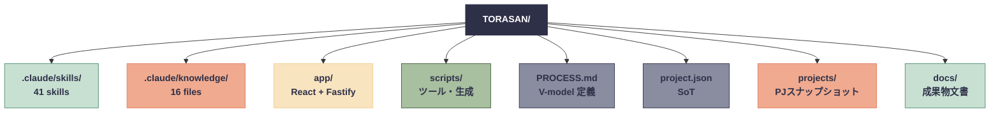

# リポジトリ構成図

```mermaid
graph TD
    ROOT["TORASAN/"]

    ROOT --> SKILLS[".claude/skills/\n41 skills"]
    ROOT --> KNOWLEDGE[".claude/knowledge/\n16 files"]
    ROOT --> APP["app/\nReact + Fastify"]
    ROOT --> SCRIPTS["scripts/\nツール・生成"]
    ROOT --> PROCESS["PROCESS.md\nV-model 定義"]
    ROOT --> PROJECT["project.json\nSoT"]
    ROOT --> PROJECTS["projects/\nPJスナップショット"]
    ROOT --> DOCS["docs/\n成果物文書"]

    classDef root fill:#2E3048,stroke:#2E3048,color:#fff,font-weight:bold
    classDef skill fill:#C8E0D2,stroke:#4A8C6F,color:#2E3048,font-weight:bold
    classDef knowledge fill:#F0AA8F,stroke:#E07A5F,color:#2E3048,font-weight:bold
    classDef app fill:#F9E4C0,stroke:#F2CC8F,color:#2E3048,font-weight:bold
    classDef tool fill:#A8BFA0,stroke:#3D5C36,color:#2E3048,font-weight:bold
    classDef config fill:#8A8DA0,stroke:#2E3048,color:#2E3048,font-weight:bold

    class ROOT root
    class SKILLS skill
    class KNOWLEDGE knowledge
    class APP app
    class SCRIPTS tool
    class PROCESS,PROJECT config
    class PROJECTS knowledge
    class DOCS skill
```
