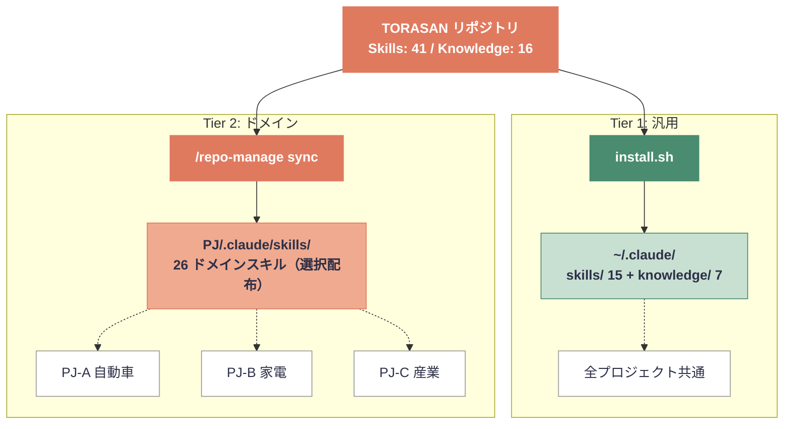

# 二層配布モデル

```mermaid
graph TD
    HUB["TORASAN リポジトリ\nSkills: 41 / Knowledge: 16"]

    subgraph TIER1["Tier 1: 汎用"]
        direction TB
        T1CMD["install.sh"]
        T1DEST["~/.claude/\nskills/ 15 + knowledge/ 7"]
        T1TGT["全プロジェクト共通"]
        T1CMD --> T1DEST
        T1DEST -.-> T1TGT
    end

    subgraph TIER2["Tier 2: ドメイン"]
        direction TB
        T2CMD["/repo-manage sync"]
        T2DEST["PJ/.claude/skills/\n26 ドメインスキル（選択配布）"]
        T2PJA["PJ-A 自動車"]
        T2PJB["PJ-B 家電"]
        T2PJC["PJ-C 産業"]
        T2CMD --> T2DEST
        T2DEST -.-> T2PJA
        T2DEST -.-> T2PJB
        T2DEST -.-> T2PJC
    end

    HUB --> T1CMD
    HUB --> T2CMD

    classDef hub fill:#E07A5F,stroke:#E07A5F,color:#fff,font-weight:bold
    classDef tier1 fill:#4A8C6F,stroke:#4A8C6F,color:#fff,font-weight:bold
    classDef tier1dest fill:#C8E0D2,stroke:#4A8C6F,color:#2E3048,font-weight:bold
    classDef tier2 fill:#E07A5F,stroke:#E07A5F,color:#fff,font-weight:bold
    classDef tier2dest fill:#F0AA8F,stroke:#E07A5F,color:#2E3048,font-weight:bold
    classDef target fill:#fff,stroke:#999,color:#2E3048

    class HUB hub
    class T1CMD tier1
    class T1DEST tier1dest
    class T2CMD tier2
    class T2DEST tier2dest
    class T1TGT,T2PJA,T2PJB,T2PJC target
```
