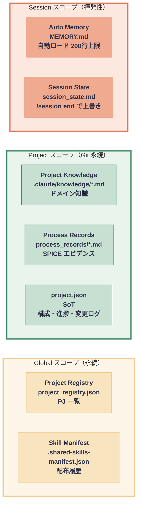

# メモリ・状態管理アーキテクチャ

```mermaid
graph TB
    subgraph SESSION["Session スコープ（揮発性）"]
        direction LR
        AM["Auto Memory\nMEMORY.md\n自動ロード 200行上限"]
        SS["Session State\nsession_state.md\n/session end で上書き"]
    end

    subgraph PROJECT["Project スコープ（Git 永続）"]
        direction LR
        PK["Project Knowledge\n.claude/knowledge/*.md\nドメイン知識"]
        PR["Process Records\nprocess_records/*.md\nSPICE エビデンス"]
        PJ["project.json\nSoT\n構成・進捗・変更ログ"]
    end

    subgraph GLOBAL["Global スコープ（永続）"]
        direction LR
        REG["Project Registry\nproject_registry.json\nPJ 一覧"]
        MAN["Skill Manifest\n.shared-skills-manifest.json\n配布履歴"]
    end

    SESSION ~~~ PROJECT ~~~ GLOBAL

    classDef sessionBox fill:#F0AA8F,stroke:#E07A5F,color:#2E3048,font-weight:bold
    classDef projectBox fill:#C8E0D2,stroke:#4A8C6F,color:#2E3048,font-weight:bold
    classDef globalBox fill:#F9E4C0,stroke:#F2CC8F,color:#2E3048,font-weight:bold

    class AM,SS sessionBox
    class PK,PR,PJ projectBox
    class REG,MAN globalBox

    style SESSION fill:#FDE8E0,stroke:#E07A5F,stroke-width:3px
    style PROJECT fill:#E8F4EC,stroke:#4A8C6F,stroke-width:3px
    style GLOBAL fill:#FDF6E8,stroke:#F2CC8F,stroke-width:3px
```

> 上から下へ: 揮発性 → 永続性
