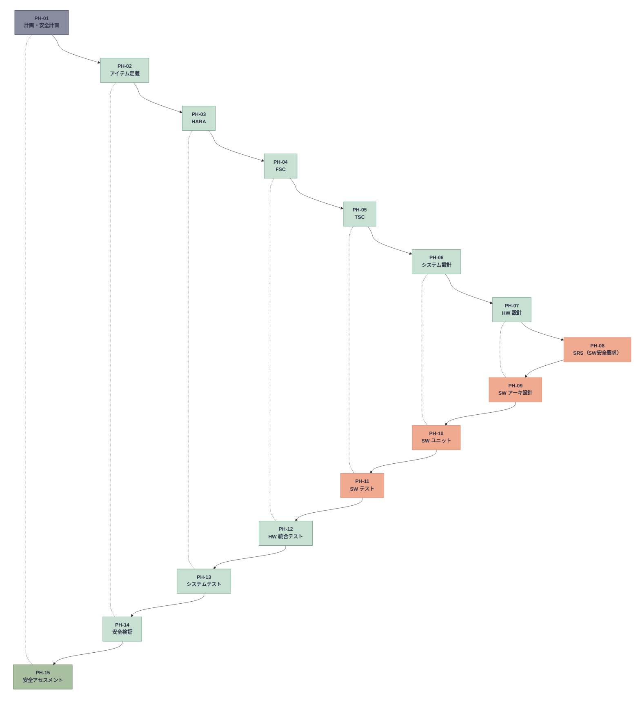

# V モデル — 15 フェーズ構成

```mermaid
graph TD
    subgraph row1[" "]
        direction LR
        PH01["PH-01\n計画・安全計画"] -.- PH15["PH-15\n安全アセスメント"]
    end

    subgraph row2[" "]
        direction LR
        PH02["PH-02\nアイテム定義"] -.- PH14["PH-14\n安全検証"]
    end

    subgraph row3[" "]
        direction LR
        PH03["PH-03\nHARA"] -.- PH13["PH-13\nシステムテスト"]
    end

    subgraph row4[" "]
        direction LR
        PH04["PH-04\nFSC"] -.- PH12["PH-12\nHW 統合テスト"]
    end

    subgraph row5[" "]
        direction LR
        PH05["PH-05\nTSC"] -.- PH11["PH-11\nSW テスト"]
    end

    subgraph row6[" "]
        direction LR
        PH06["PH-06\nシステム設計"] -.- PH10["PH-10\nSW ユニット"]
    end

    subgraph row7[" "]
        direction LR
        PH07["PH-07\nHW 設計"] -.- PH09["PH-09\nSW アーキ設計"]
    end

    PH08["PH-08\nSRS（SW安全要求）"]

    PH01 --> PH02 --> PH03 --> PH04 --> PH05
    PH05 --> PH06 --> PH07 --> PH08
    PH08 --> PH09 --> PH10 --> PH11
    PH11 --> PH12 --> PH13 --> PH14 --> PH15

    classDef man fill:#8A8DA0,stroke:#2E3048,color:#2E3048,font-weight:bold
    classDef sys fill:#C8E0D2,stroke:#4A8C6F,color:#2E3048,font-weight:bold
    classDef swe fill:#F0AA8F,stroke:#E07A5F,color:#2E3048,font-weight:bold
    classDef sup fill:#A8BFA0,stroke:#3D5C36,color:#2E3048,font-weight:bold
    classDef invisible fill:transparent,stroke:transparent

    class PH01 man
    class PH02,PH03,PH04,PH05,PH06,PH07 sys
    class PH12,PH13,PH14 sys
    class PH08,PH09,PH10,PH11 swe
    class PH15 sup

    style row1 fill:transparent,stroke:transparent
    style row2 fill:transparent,stroke:transparent
    style row3 fill:transparent,stroke:transparent
    style row4 fill:transparent,stroke:transparent
    style row5 fill:transparent,stroke:transparent
    style row6 fill:transparent,stroke:transparent
    style row7 fill:transparent,stroke:transparent
```

**凡例**: MAN (管理) / SYS (システム) / SWE (ソフトウェア) / SUP (サポート)
点線 = 検証対応関係（左右が同行でペア）
