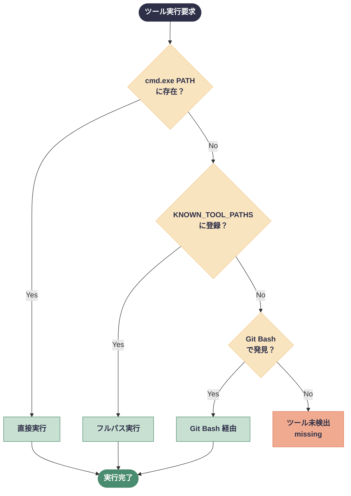

# ツールパス解決フロー

```mermaid
flowchart TD
    START(["ツール実行要求"])
    D1{"cmd.exe PATH\nに存在？"}
    D2{"KNOWN_TOOL_PATHS\nに登録？"}
    D3{"Git Bash\nで発見？"}
    R1["直接実行"]
    R2["フルパス実行"]
    R3["Git Bash 経由"]
    FAIL["ツール未検出\nmissing"]
    OK(["実行完了"])

    START --> D1
    D1 -- "Yes" --> R1 --> OK
    D1 -- "No" --> D2
    D2 -- "Yes" --> R2 --> OK
    D2 -- "No" --> D3
    D3 -- "Yes" --> R3 --> OK
    D3 -- "No" --> FAIL

    classDef start fill:#2E3048,stroke:#2E3048,color:#fff,font-weight:bold
    classDef decision fill:#F9E4C0,stroke:#F2CC8F,color:#2E3048,font-weight:bold
    classDef success fill:#C8E0D2,stroke:#4A8C6F,color:#2E3048,font-weight:bold
    classDef fail fill:#F0AA8F,stroke:#E07A5F,color:#2E3048,font-weight:bold
    classDef done fill:#4A8C6F,stroke:#4A8C6F,color:#fff,font-weight:bold

    class START start
    class D1,D2,D3 decision
    class R1,R2,R3 success
    class FAIL fail
    class OK done
```

> **解決順序**: cmd.exe PATH → KNOWN_TOOL_PATHS → Git Bash
> **KNOWN_TOOL_PATHS**: `environmentService.ts` で管理
> **新規ツール追加時**: `error_prevention.md` §E フロー参照
